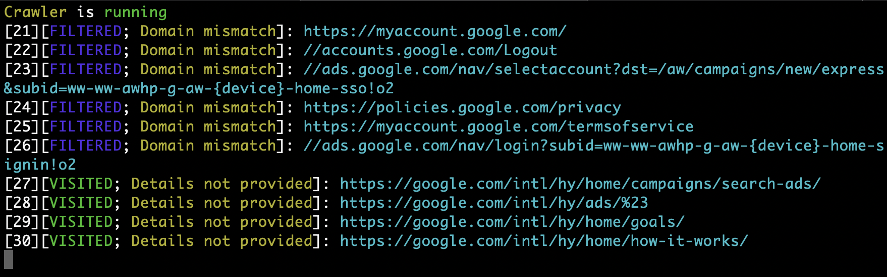

# Crawler implemented in Golang.

## Key Features:

- Ability to add filters for requests, both pre-defined and custom.
- Ability to add request pre-processors.
- Ability to add response processors.
- Graceful shutdown support with the ability to save the current crawling state for later resumption.
- Displaying the states of each request and their details.
- Handling common errors.

## Important Points:
- The crawler was developed quickly as a test assignment.
- Due to the previous point, there may be bugs/errors in the code.
- Some parts are intentionally unfinished – I chose not to spend time on them, but there shouldn't be any problem improving them.
- The crawler is NOT production-ready (but close to it with some polishing).
- The mechanism for saving downloaded pages is implemented as a proof of concept – it saves pages but without preserving site structure, etc. This would require a separate, more comprehensive solution.
- I understand the weak points and unfinished areas very well; all such aspects were intentionally skipped.

- That's about it. Thanks to everyone who took the time to read this!

## Commands

Common run:
```bash
clear && go run main.go --url=https://google.com/ --snapshot-file-path=state.dump --data-file-path=data
```
Run from snapshot:
```bash
clear && go run main.go --url=https://google.com/ --snapshot-file-path=state.dump --data-file-path=data --use-state
```


# Краулер реализованный на голенге.

## Отличительные особенности:
- Есть возможность добавлять фильтры для реквестов, как предустановленные, так и кастомные
- Есть возможность добавлять пре-процессоры запросов
- Есть возможность добавлять процессоры ответов
- Есть поддержка грейсфул шатдауна с сохранением текущего состояния краулинга (с дальнейшим запуском из сохраненного состояния)
- Отображение состояний каждого запросы и их деталей
- Обработка основных ошибок

## Важные моменты:
- Краулер делался на скорую руку в качестве тествого задания.
- Исходя из предыдущего пункта - в нем могут быть баги/ошибки
- Некоторые места не доделаны намеренно - я просто не стал тратить на это время, но в целом нет проблемы их улучшить
- Краулер НЕ продакшен рэди (но близко к этому, если обработать напильником)
- Процессор сохранения скачанных страниц реализован условно, чисто как пруф оф концепт - сохранение есть, но без сохранения структуры сайта и тп, это отдельная большая история, если делать по уму
- Я очень хорошо понимаю слабые места и недоделанные места, все такие моменты были пропущены намеренно

Ну собственно вот и все. Спасибо всем, кто зашел ознакомиться :)

## Команда запуска

Обычный запуск:
```bash
clear && go run main.go --url=https://google.com/ --snapshot-file-path=state.dump --data-file-path=data
```
Запуск из снапшота:
```bash
clear && go run main.go --url=https://google.com/ --snapshot-file-path=state.dump --data-file-path=data --use-state
```